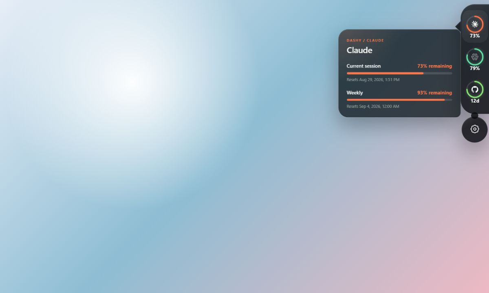
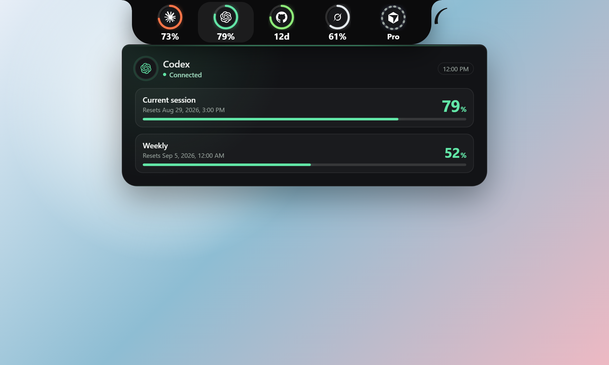
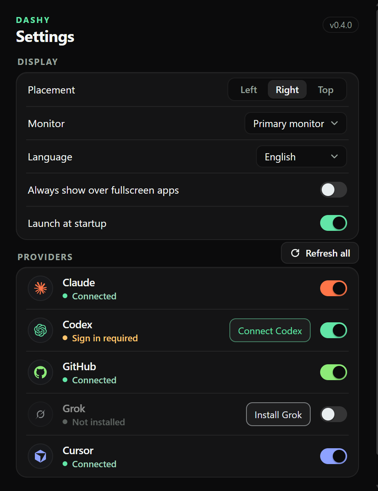

# Dashy

Dashy is a local-first Windows side-notch for real, CLI-backed signals:

- Claude session and weekly usage windows
- Codex session and weekly usage windows
- GitHub contribution activity and current streak
- Grok monthly credit-pool usage
- Cursor account and plan status (Cursor's CLI exposes no usage percentages)

Dashy does not use demo metrics. It reads the authenticated command-line tools already
installed on the computer and renders only the bounded status and usage fields needed
by the interface.



## The experience

Dashy keeps useful account activity one deliberate pointer movement away without
becoming another dashboard that occupies the desktop. The compact rail rests just
outside the selected screen edge, reveals on hover, and expands only the provider
the user asks to inspect. The rail is a solid tab that blends into the screen edge
with concave fillets, so it reads as part of the display frame rather than a
floating window.

Each provider is a ring tile: its glyph inside a dark disc, the ring filled with the
provider's color, and one bold value below it. Hovering a tile opens its card
centered on that tile. The card shares the same language: the provider glyph in a
disc, a connected line, the last refresh time, and inset boxes with large numbers
for usage windows, streaks, or the account plan.

| GitHub card on the left edge | Codex card on the top edge |
| --- | --- |
|  |  |

Every provider is optional. A user can connect Claude, Codex, GitHub, Grok, Cursor,
any combination of them, or none during first-run setup. Dashy relies on each
provider's existing, authenticated CLI session and never asks the user to paste
subscription credentials or access tokens into the application.

The screenshots in this README are deterministic UI fixtures rendered from the same
React components used by the desktop application. Values are illustrative; the
installed application displays only locally retrieved provider data.

## How the side notch works

Dashy normally sits completely outside the selected monitor's usable work area. It
does not reserve desktop space and its hidden window does not block edge clicks,
scrollbars, or other applications.

Move the pointer into the 28 px activation zone on the configured edge and hold it
there briefly to reveal the compact rail. Hover or focus any enabled provider to
open its detail card. The rail and card form one safe pointer region; when the pointer
leaves it, the Rust desktop controller owns the short dismissal grace period.

Click a provider to pin its card and refresh only that provider. Duplicate refreshes
for the same provider are coalesced. A failed refresh keeps the last verified value
and marks it as stale instead of displaying a fabricated zero.

While a card is pinned, moving or tabbing across another metric does not replace it.
Clicking a different provider switches the pinned card and refreshes that provider in
one action; clicking the already pinned provider unpins it. Reveal and dismissal use
short edge-bound animations, while the Rust controller retains the bounded hide
fallback if the WebView cannot acknowledge an exit animation.

Keyboard behavior:

- Arrow keys move through providers vertically on the right and left placements.
- Left and Right Arrow move through providers on the top placement.
- Enter, Space, or clicking a provider pins it and starts its scoped refresh.
- Tab and Shift+Tab stay inside Dashy while a card is pinned.
- Escape closes a pinned or expanded card to the rail; a second Escape hides the rail.

Right-click the visible notch for its compact native menu.

A small tapered tail curls out of the end of the rail. Hovering or keyboard-focusing
it grows a round gear bubble, attached to the rail, that opens Settings directly.
It works in the right, left, and top placements.


## Settings

Open Settings from the rail's gear, the tray, or the notch context menu.



- **Display:** placement (Left, Right, Top), monitor, language, the fullscreen
  override, and launch at startup.
- **Providers:** one row per provider with its status, an inline install or connect
  action only when something needs attention, and a switch to enable it in the rail.
  **Refresh all** re-reads every enabled provider.

Settings are stored locally. The startup option uses the operating system's normal
autostart registration and remains off until explicitly enabled.

## Placement, monitors, and fullscreen

Dashy supports three physical placements:

- Right edge, with cards opening left
- Left edge, with cards opening right
- Top edge, with cards opening down

Choose the primary monitor or a specific connected monitor. Dashy persists a stable
monitor preference with recovery metadata. If that monitor is missing, Dashy safely
falls back to the primary monitor without deleting the saved preference. Work-area
positioning respects the Windows taskbar, and display or DPI changes trigger
repositioning.

Dashy hides when another application is fullscreen on the selected monitor by
default. Enable **Always show over fullscreen apps** in Settings to override that
behavior.

The system tray remains available while the notch is hidden or fullscreen-suppressed.
Its menu provides Show Dashy, Refresh all providers, placement and monitor choices,
Settings, and Quit Dashy.

## Languages

Dashy supports English, Hebrew, Arabic, Spanish, Russian, French, Simplified
Chinese, and Japanese. English is the first-run default. Hebrew and Arabic mirror
the content layout for RTL reading, but language direction never changes the user's
physical screen placement.

## Provider data

GitHub activity comes from the authenticated GitHub CLI viewer's contribution
calendar. Dashy derives today's activity and the current streak without treating
GitHub as a percentage.

Codex usage comes from the local `codex app-server --stdio` rate-limit response.
Dashy retains the supported short and weekly general windows, summarizes the lower
remaining percentage in the compact ring, and excludes model-specific, preview, and
special-program buckets.

Claude usage comes from the documented Claude Code `/usage` interface through its
non-interactive JSON output. Dashy retains the current-session and all-models general
windows and excludes model-specific preview limits. A window that has no reset time
yet (nothing consumed) is shown without one.

Grok usage comes from the Grok Build CLI's `agent stdio` JSON-RPC surface as a
single monthly credit-pool window. Builds that do not expose billing over stdio
degrade to an unavailable state, and a signed-out CLI reads as sign-in required.

Cursor state comes from `cursor-agent status` and `about` in their JSON output
modes. Cursor's CLI reports the connection and plan tier but no usage numbers, so
its tile and card show the account state and point to the Cursor dashboard for
usage.

The dashboard primes its local cache on startup and refreshes periodically. Each
provider remains isolated: one unavailable or signed-out CLI does not prevent the
other providers from working.

## Install Dashy on Windows

1. Open the [latest GitHub Release](https://github.com/adirangel/Dashy/releases/latest).
2. Download the Windows x64 `.msi` asset.
3. Run the installer and leave **Launch Dashy** selected on the final page.
4. Dashy opens its setup window: choose a language, then pick any combination of
   Claude, Codex, GitHub, Grok, and Cursor.
5. Install or connect only the providers you selected, approving each visible
   command separately.

Upgrades from an older build reopen the provider chooser once, with the existing
choices preselected. Completing it records the current setup version so later
upgrades preserve the selection without prompting again.

The current private-test MSI is not code-signed, so Windows may show an
**Unknown publisher** or SmartScreen warning. Code signing is required before a
public release.

Node.js, Rust, Cargo, Tauri, and Visual Studio Build Tools are development
requirements only. End users do not install them.

## Contributing

Read [CONTRIBUTING.md](CONTRIBUTING.md) first: it covers the rules that never bend (CLI-only, bounded parsing, every locale ships), the local gates that CI runs on every pull request, and how to report problems. Security issues go through [SECURITY.md](SECURITY.md).

## Contributor prerequisites

The requirements in this section apply only when developing or packaging Dashy
from this repository. They are not needed to install the Windows MSI above.

| Tool | Purpose |
|---|---|
| Git | Repository commands |
| GitHub CLI (`gh`) | GitHub contribution data and sign-in |
| Node.js LTS and npm | Frontend dependencies and Vite |
| Rust and Cargo | Rust backend and Tauri compilation |
| Microsoft C++ Build Tools | MSVC compiler and `link.exe` |
| Microsoft Edge WebView2 Runtime | Tauri's Windows webview |
| Tauri CLI 2 | Desktop development and packaging |
| Provider CLIs (Claude Code, Codex, Grok Build, Cursor) | Provider metrics during development |

See the [Tauri v2 Windows prerequisites](https://v2.tauri.app/start/prerequisites/)
for the platform toolchain details; each tool's official installer is the source of
truth for its own setup.

## Contributor setup

Open PowerShell in the repository. The bootstrap script first lets you inspect the
development machine without changing it:

```powershell
.\install.ps1 -CheckOnly
```

`-CheckOnly` does not install software, change `PATH`, request administrator
access, or start a provider login.

To install missing prerequisites and the locked frontend dependencies:

```powershell
.\install.ps1
```

The installer uses WinGet package IDs, skips available commands and packages, never
removes or downgrades a tool, refreshes only the current PowerShell process's
`PATH`, installs Tauri CLI 2 only when needed, and runs `npm ci` in `frontend`. The
Visual Studio Build Tools installer may request elevation. If a newly installed
command is still unavailable, open a new PowerShell window and rerun the installer.

## Provider CLI sign-in for contributors

The bootstrap script never signs in for you. When developing from this repository,
complete only the provider CLI logins you need:

```powershell
gh auth login
claude auth login
codex login
grok login
cursor-agent login
```

Check the existing CLI sessions with:

```powershell
gh auth status --active
claude auth status --json
codex login status
cursor-agent status --format json
```

Grok has no status command; Dashy detects its sign-in state through the same
stdio handshake it uses for usage.

On Windows, Dashy recognizes both a standalone Codex executable and the standard
global npm installation (`codex.cmd`), and the Cursor CLI's `cursor-agent.cmd`
wrapper. Restart Dashy after installing or updating a provider CLI so it inherits
the latest `PATH`.

Use each provider's own browser or terminal flow. Do not paste a token into Dashy,
the installer, source files, or this README.

## Run Dashy

For a browser-only visual preview of the notch:

```powershell
Set-Location frontend
npm run dev
```

Open `http://localhost:5173/?fixture=1&placement=right&provider=claude&background=bright`
to render the deterministic fixture used for the screenshots above. Provider calls
and native edge behavior are intentionally unavailable in a browser preview.

For the Windows desktop application:

```powershell
Set-Location backend
cargo tauri dev --no-watch
```

The first run can take several minutes while Cargo builds dependencies. Dashy starts
hidden; move the pointer to the configured edge or use **Show Dashy** from the tray.

## Privacy

Provider credentials remain owned by `gh`, `claude`, `codex`, `grok`, and
`cursor-agent`. Dashy does not request, store, print, or inspect tokens, browser
cookies, password-manager data, or credential files, and it makes no network
requests of its own: every signal comes from a local CLI.

The Rust backend invokes the installed CLIs with bounded timeouts, parses only the
reviewed response fields, and sends the React UI sanitized provider states. Native
edge events contain only visibility, placement, and provider identifiers, never
cursor coordinates, monitor metadata, raw CLI output, account identity, or errors.

## Test and build

```powershell
Set-Location frontend
npm test
npm run build

Set-Location ..\backend
cargo fmt --check
cargo test --locked
cargo clippy --all-targets --locked -- -D warnings
```

To build Windows bundles:

```powershell
Set-Location backend
cargo tauri build -- --locked
```

Bundle output is generated under `backend/target/release/bundle` and is not tracked.

Releases follow an immutable-tag, five-file version-bump process with a read-only
build job and a draft-first publish. The full guarded procedure lives in
[docs/RELEASE.md](docs/RELEASE.md).

## Troubleshooting

- **`winget` is missing:** install or update Microsoft App Installer, reopen
  PowerShell, and run `.\install.ps1 -CheckOnly`.
- **A newly installed command is still missing:** reopen PowerShell and run the
  check-only command again.
- **`link.exe` is missing:** install the Visual Studio Build Tools **Desktop
  development with C++** workload, then open a new shell.
- **A provider says "Not installed":** install that provider's CLI and restart Dashy.
- **A provider says "Sign in required":** complete its CLI login flow outside Dashy.
- **A provider is unavailable or stale:** the CLI may have timed out, lost network
  access, or changed its supported output. Dashy keeps the last verified local value.
- **The notch does not reveal:** check the selected placement and monitor, then use
  Show Dashy from the tray. A fullscreen application may be suppressing it.
- **A saved monitor is disconnected:** Dashy falls back to the primary monitor; reconnect
  it or choose a new monitor in Settings.
- **The tray is not visible:** check the Windows hidden-icons area.

## License

Dashy is released under the [MIT License](LICENSE).
